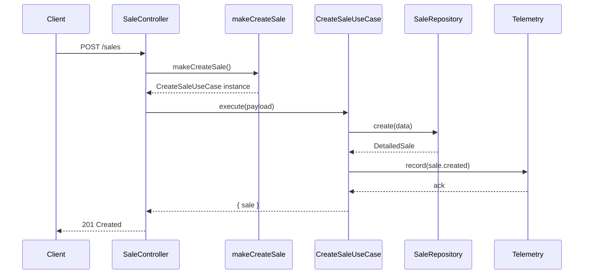

# Sale Flow Overview

## HTTP Controllers
- `src/http/controllers/sale/create-sale-controller.ts`
- `src/http/controllers/sale/list-sales-controller.ts`
- `src/http/controllers/sale/get-sale-controller.ts`
- `src/http/controllers/sale/update-sale-controller.ts`
- `src/http/controllers/sale/remove-add-sale-item-controler.ts`
- `src/http/controllers/sale/update-coupon-sale-controller.ts`
- `src/http/controllers/sale/update-client-sale-controller.ts`
- `src/http/controllers/sale/pay-sale-controller.ts`
- `src/http/controllers/sale/update-sale-item-controler.ts`
- `src/http/controllers/sale/update-coupon-sale-item-controler.ts`
- `src/http/controllers/sale/update-sale-item-barber-controller.ts`
- `src/http/controllers/sale/update-sale-item-quantity-controller.ts`
- `src/http/controllers/sale/update-sale-item-custom-price-controller.ts`

## Service Factories
- `src/modules/sale/infra/factories/make-create-sale.ts`
- `src/modules/sale/infra/factories/make-list-sales.ts`
- `src/modules/sale/infra/factories/make-get-sale.ts`
- `src/modules/sale/infra/factories/make-sale-telemetry.ts`
- `src/modules/sale/infra/factories/make-update-sale.ts`
- `src/modules/sale/infra/factories/make-remove-add-sale-item.ts`
- `src/modules/sale/infra/factories/make-update-sale-coupon.ts`
- `src/modules/sale/infra/factories/make-update-client-sale.ts`
- `src/modules/sale/infra/factories/make-get-item-build.ts`
- `src/modules/sale/infra/factories/make-get-items-build.ts`
- `src/modules/sale/infra/factories/make-sale-item-update-executor.ts`
- `src/modules/sale/infra/factories/make-sale-item-coordinator.ts`
- `src/modules/finance/infra/factories/make-pay-sale.ts`
- `src/modules/sale/infra/factories/make-recalculate-user-sales.ts`
- `src/modules/finance/infra/factories/make-list-user-pending-commissions.ts`
- `src/modules/finance/infra/factories/make-list-user-sold-products.ts`

## Core Services / Use Cases
- `src/modules/sale/application/services/sale-totals-service.ts`
- `src/modules/sale/application/services/sale-item-update-executor.ts`
- `src/modules/sale/application/use-cases/update-sale-item-coupon.ts`
- `src/modules/sale/application/use-cases/update-sale-item-barber.ts`
- `src/modules/sale/application/use-cases/update-sale-item-quantity.ts`
- `src/modules/sale/application/use-cases/update-sale-item-custom-price.ts`
- `src/modules/sale/application/use-cases/update-sale-item-details.ts`
- `src/modules/sale/application/use-cases/create-sale.ts`
- `src/services/sale/update-sale.ts`
- `src/modules/sale/application/use-cases/get-sale.ts`
- `src/modules/sale/application/use-cases/list-sales.ts`
- `src/modules/sale/application/contracts/sale-telemetry.ts`
- `src/modules/sale/application/use-cases/update-sale-coupon.ts`
- `src/modules/sale/application/use-cases/update-sale-client.ts`
- `src/modules/sale/application/use-cases/remove-add-sale-item.ts`
- `src/modules/finance/application/use-cases/pay-sale.ts`
- `src/modules/sale/application/use-cases/recalculate-user-sales.ts`

## Repository Interfaces
- `src/repositories/sale-repository.ts`
- `src/repositories/sale-item-repository.ts`
- `src/repositories/coupon-repository.ts`
- `src/repositories/product-repository.ts`
- `src/repositories/service-repository.ts`
- `src/repositories/appointment-repository.ts`
- `src/repositories/plan-repository.ts`
- `src/repositories/plan-profile-repository.ts`
- `src/repositories/transaction-repository.ts`

## Supporting Utilities
- `src/services/sale/utils/item.ts`
- `src/services/sale/utils/sale.ts`
- `src/services/sale/utils/coupon.ts`
- `src/services/sale/utils/plan.ts`
- `src/services/sale/utils/profit-distribution.ts`

## High-Level Flow
1. Controllers recebem requisições e delegam para as factories correspondentes.
2. As factories instanciam use cases/services, injetando repositórios Prisma.
3. Casos de uso orquestram a lógica de negócio e reutilizam serviços utilitários (ex.: `SaleItemUpdateExecutor`, `SaleTotalsService`).
4. Telemetria (`SaleTelemetry`) captura os eventos `sale.created`, `sale.list`, `sale.viewed` e demais operações sensíveis.
5. Os serviços aplicam validações, recalculam totais, atualizam estoque e persistem as mudanças via repositórios.
6. Eventos complementares (ex.: `recalculate-user-sales.ts`) são executados após as operações principais quando necessário.

## Sequence diagram (HTTP create sale)

## Observabilidade e testes
- Telemetria centralizada garante rastreabilidade das operações de listagem, leitura e criação.
- O arquivo `test/integration/sale/sale-http.spec.ts` cobre os fluxos de criação, listagem, atualização e pagamento via HTTP.
- A coleção `insominia-barbershop.yaml` possui exemplos alinhados aos novos payloads dos use cases.

## Pontos de atenção restantes
- Alguns utilitários (`get-items-build`) permanecem em `src/services`, porém só são consumidos via factories novas.
- Avaliar extração futura de utilitários remanescentes em `src/services/sale/utils/*` para o módulo, seguindo o padrão aplicado em `pay-sale` e `recalculate-user-sales`.

Este documento deve ser mantido atualizado conforme novos módulos forem migrados para a nova arquitetura.
